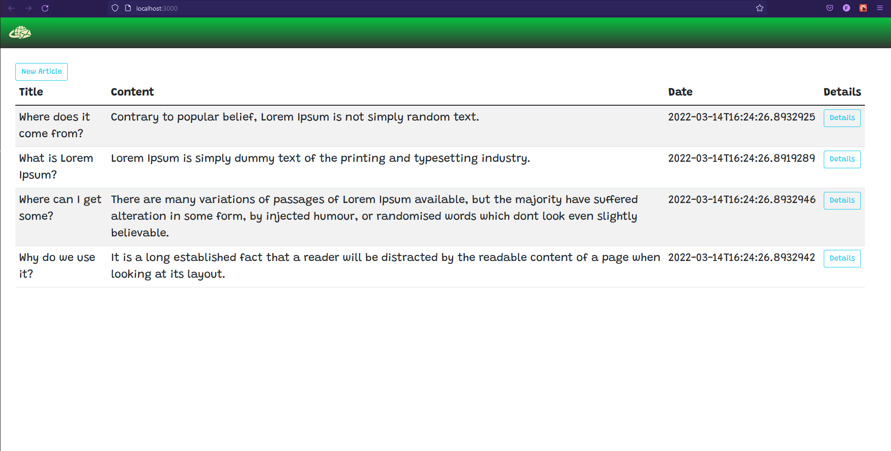
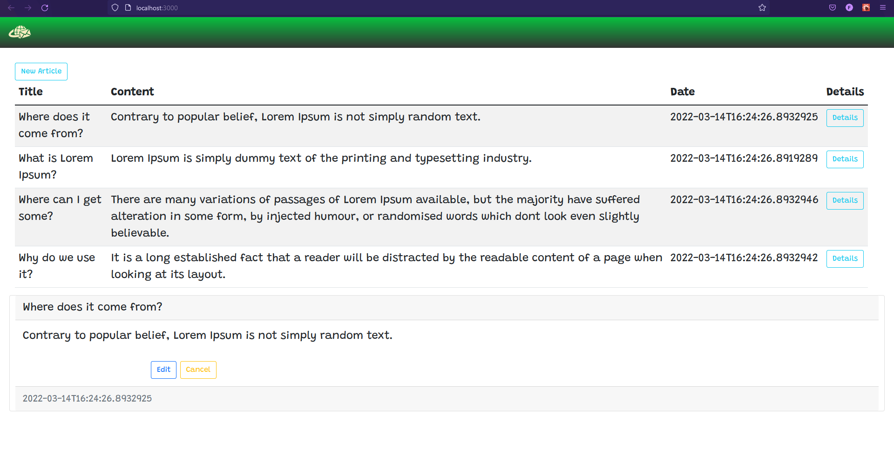

# Asp.Net Core Web Api => using .net core 5 and React

Project still under developement

## Screenshots showing front-end connection to back-end

.png)

## Bootstrap Styling updates with details component hook

## More Styling added and added "Create" and "Update" functions

## Finished axios calls and changed page layout

