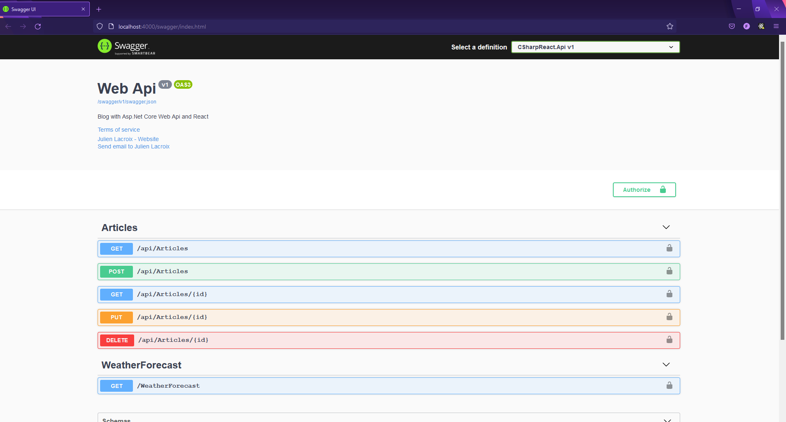
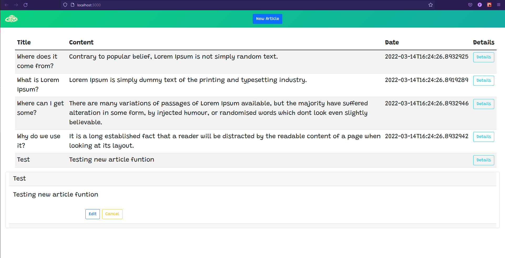
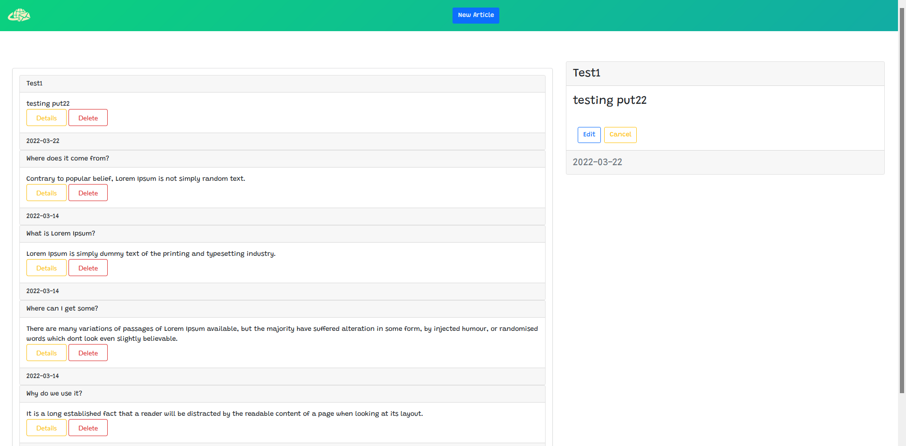

# Asp.Net Core Web Api => using .net core 5 and React
```css
Project still under developement
```

### Screenshots showing front-end connection to back-end

<br/>

<details>
  <summary>Open screenshot</summary>


  .png)
</details>

<br/>

<details>
  <summary>Open screenshot</summary>

  
</details>

<br/>

### More Styling added and added "Create" and "Update" functions

<br/>

<details>
  <summary>Open screenshot</summary>
  
  
</details>

<br/>

### Finished axios calls and changed page layout

<br/>

<details>
  <summary>Open screenshot</summary>
  
  
</details>

<br/>

## Why axios?

- It offers the kind of features that we would get if we were using a full framework like Angular (which comes with a powerful http client). 

- React is a library and does not come with a facility and to get that kind of functionality we need to add a package.

<br/>

## What is Mobx?
<br/>

```
Is a package to use Observables instead of Promises 
```

<b>Observables</b> => are concerned with the state of things over time, you can observe and as state changes over time you can react to that state change.


<b>Promises</b> => is a 1 time thing, you ask for something and than it gives it back.

<b>Actions</b> => change the state of obsevables

<b>Computed Properties</b> => If there is already some state inside an observable and we want to derive from the state from what we already have is when we can use computed properties.

<b>Reactions</b> => Any of our observable states, we can react to it changing in some way and use a side effect which will do something in the application. It wait until the observable has changed from its initial state and then you'll react to that change.

<b>AutoRun</b> => Is similar to Reactions, but it will always run even when the store is initialized before the observable you're reacting to has actually changed.

<br />

### Why not use a more popular package => redux?
<br/>

```
Because MobX uses Typescript and is fast and easy to work with.
```

<br/>

## Router

Single page applications need routers because they only have 1 page (index.html).

- Although small apps could just use conditionals

For this app I'll be using react router which I believe is the most popular choice.

### How does it work?

- It's API is simple. It starts with ```<BrowserRouter>``` and we surround our app with it.

- Inside our App we use ```<Route>``` components which gets replaced with the components that we want to load when that particular route is navigated.

- There is also 3 types of link we can use

  1. ```<Link>``` 
  2. ```<NavLink>```
  3. ```<Redirect>``` 

<br/>

## Router hooks

There are 4 types of router hooks.

1. <b>useHistory</b> => React router uses a history object to keep track of the users (or browser's) current location. The history object that we use provide certain functionality and has methods that allow us to push the new route into the history and that re-render's and loads up the component that we've gone to.

2. <b>useLocation</b> => It allows us to get the location where we're currently at and any attributes about the location.

3. <b>useParams</b> => It allow us to use paramaters if there are route parameters. 

4. <b>useRouteMatch</b> => It does the same thing as the routes components and how it matches url to a particular route.

